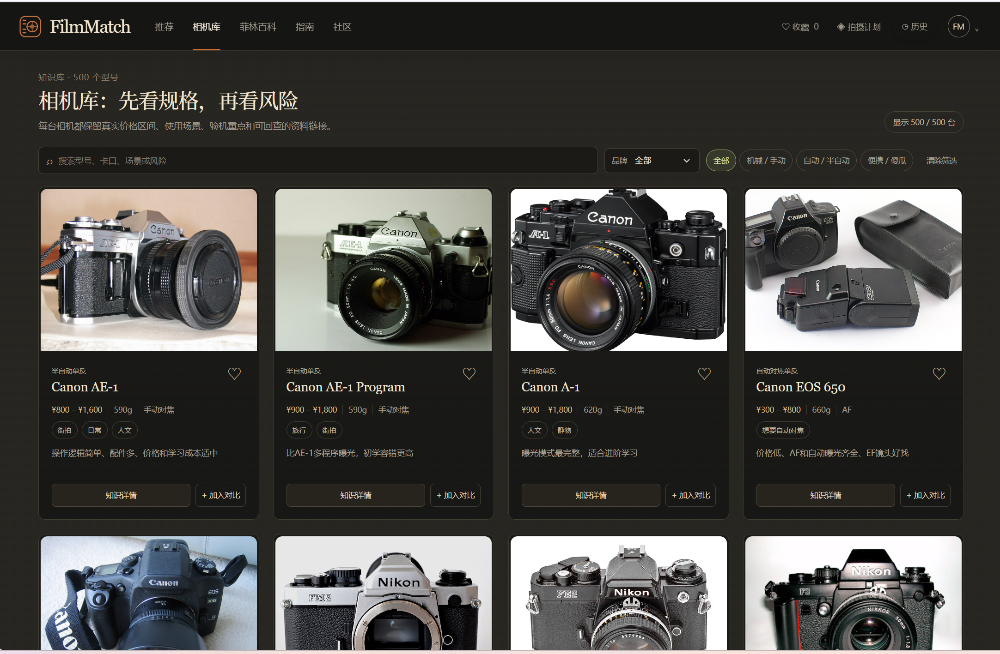

# FilmMatch｜你的胶片推荐官

> 帮胶片新手少踩坑、选对第一套装备。
>
> FilmMatch 把预算、操作门槛、拍摄场景、画面偏好和二手风险，整理成一套可以直接开始拍摄的胶片机 + 第一卷胶片方案。

## 在线体验

**当前公开 MVP：** [打开 FilmMatch](https://filmmatch-public-mvp.weijingjie666.chatgpt.site/)

本 README 中的产品截图全部来自当前本地版本：<http://127.0.0.1:4174/>

## 产品截图

### 首页与 3 分钟测评入口

左侧是结构化偏好测评，右侧实时展示当前推荐结果；完成测评后解锁最终推荐。


### 相机推荐与匹配解释

结果页展示 Top 3 相机、匹配分、适用场景、短板、风险和匹配维度，避免只给一个型号名称。


### 相机库

相机库独立成页，支持按品牌、相机类型和关键词检索，展示规格、价格区间、风险和知识详情。



### 菲林百科与快速索引

菲林百科同时覆盖胶卷和胶片机知识，并提供可回查的索引入口。


## 项目简介

FilmMatch 是一个面向胶片新手的结构化选购决策工具。它不只回答“哪台相机热门”，而是把用户的预算、操作能力、拍摄场景、便携需求、画面风格和风险偏好，转译成可解释、可比较、可执行的装备方案。

产品把以下环节串成一条决策链：

```text
偏好测评 → Top 3 相机推荐 → 第一卷胶片方案 → 成本计算 → 三机对比
        → 相机库 / 菲林百科 / 拍摄指南 → 收藏、历史与拍摄计划
```

## 当前产品规模

当前公开版本已覆盖：

**500 台胶片相机、35 款胶卷、41 条场景化选卷指南，以及 46 篇菲林百科内容。**

- 相机库：规格、二手市场参考价格、使用场景、风险、验机重点和资料来源；
- 胶卷库：Kodak、Fujifilm、ILFORD 等主流胶卷及其 ISO、风格、适用光线和冲扫提示；
- 场景指南：旅行、日常、人像、风景、街拍、室内、夜景、季节、光线和主题等场景；
- 菲林百科：胶卷、曝光、光圈、快门、ISO、胶片机类型、卡口兼容和二手验机。

## 技术栈与实现方式

技术名称按当前项目真实实现填写：

| 模块 | 实现方式 |
| --- | --- |
| 数据整理 | Excel 整理相机、胶卷、价格、风险和资料来源；运行时数据落为 JavaScript 数据模块 |
| 前端实现 | 原生 HTML、CSS、JavaScript ES Modules；未使用 React、Vue 或其他前端框架 |
| 推荐引擎 | 场景/预算/操作/便携/新手友好/维护风险的规则匹配、加权评分和硬性筛选 |
| 数据存储 | 浏览器 `localStorage`，保存偏好、收藏、历史、对比和拍摄计划 |
| AI 协作 | Codex 辅助开发、资料整理、规则校验和内容生产；产品判断与数据审核由人工负责 |
| 构建与本地运行 | Node.js 18+，自带无依赖静态服务器和静态构建脚本 |
| 部署 | ChatGPT 托管公开 MVP；独立域名及服务器部署仍在推进 |

## 源码与数据结构

本仓库提供可直接运行的完整源码，不是只有 `dist/` 或单个 HTML 成品。项目采用原生 HTML、CSS 和 JavaScript ES Modules，没有使用 React、Vue、Vite，也没有第三方 npm 运行依赖，因此不需要 `package-lock.json`。

```text
index.html                 页面入口
src/main.js                页面渲染、测评状态、推荐排序、成本计算和交互逻辑
src/styles.css             主样式
src/overrides.css          页面适配与局部样式覆盖
src/image-layout.css       相机图片容器和裁剪规则
src/data/
├── cameras.js             主相机数据
├── all-cameras.js         500 台相机的汇总导出
├── camera-expansion*.js   扩展相机数据来源模块
├── camera-images.js       相机型号与图片、来源、alt 文本映射
├── film-library.js        胶卷数据库
├── film-prices.js         胶卷价格与价格来源
└── knowledge-base.js      菲林百科、胶卷指南、相机知识和资料来源
serve.mjs                  本地开发/预览静态服务器
build-static.mjs           静态构建脚本
package.json               npm scripts 和 Node.js 版本要求
```

完整的数据字段与规则入口见 [数据结构说明](docs/data-map.md)。

## 核心功能

### 1. 3 分钟、11 项偏好测评

用户回答预算、操作偏好、便携性、拍摄场景、画面风格、光线、使用场合、维护风险和已有设备等问题。预算与不可接受的维护风险用于硬筛选，其他维度参与候选排序。

### 2. 可解释的 Top 3 相机推荐

推荐结果同时展示匹配度、参考价格、适用场景、主要短板、替代型号、常见风险和购买前验机重点。匹配分表示“与当前偏好的契合度”，不代表相机质量，也不代表购买成功率。

### 3. 相机 + 第一卷胶片方案

系统结合拍摄对象、光线、季节、画面风格、ISO、曝光宽容度和购买/冲扫便利度，为用户推荐第一卷胶片，并展示预估体验成本和失败风险。

### 4. 成本计算与三机对比

成本不只计算机身，还会拆分胶卷、冲洗、扫描、邮费、电池和维修预留等项目。用户最多可同时对比 3 台相机，并从预算、重量、操作、维护、场景和升级空间进行取舍。

### 5. 相机库、菲林百科与拍摄计划

相机库独立成页，菲林百科同时覆盖胶卷和胶片机；用户还可以保存收藏、历史推荐、三机对比及“相机 + 胶卷”拍摄计划。

## 推荐机制

FilmMatch 当前是可解释的规则推荐引擎，不依赖大模型临时生成型号：

```text
综合匹配分 = 预算匹配 × 16%
           + 操作适配 × 12%
           + 场景适配 × 45%
           + 便携性   × 10%
           + 新手友好 ×  8%
           + 维护风险 ×  9%
```

场景部分进一步区分宽泛场景和具体用途：命中用户选择的核心场景会加权，未命中具体主场景会扣分，同时命中多个场景的型号优先。系统还会排除价格下限明显超预算、维护风险超过接受范围或关键规格冲突的型号。

## 用户研究与产品背景

编码前完成 24 题探索性问卷，有效样本 15 份，用于形成用户画像和 MVP 假设，不外推至全部胶片用户。研究显示，用户最关心的是预算、上手门槛、二手风险、完整体验成本，以及买到相机后第一卷胶片怎么选。

FilmMatch 的产品价值不只是生成一段器材介绍，而是提前替用户完成需求收集、候选筛选、成本拆解、风险提示和下一步行动设计。

## 首轮冷启动真实数据

以下数据来自小红书早期冷启动，用于验证是否有人愿意主动提交需求、等待结果并继续交流；它们不是站内完整转化数据，也不代表成熟产品的留存率或付费结论。

| 指标 | 结果 |
| --- | ---: |
| 最高单篇浏览量 | 1428 |
| 该篇获赞 | 74 |
| 该篇收藏 | 27 |
| 评论区互动 | 88 条 |
| 对工具感兴趣的私信 | 3 条 |
| 新增粉丝 | 20+ |
| #FilmMatch 词条累计浏览量 | 1637 |
| #FilmMatch 词条讨论 | 108 |

冷启动阶段还完成了首批 25 份结构化详细回复，覆盖不同预算、操作方式和拍摄场景，并将回复结构沉淀为 Top 3、第一卷胶片、成本、风险和验机重点的服务 SOP。

## 正式上线后的产品漏斗与埋点方案

以下是正式上线后计划验证的产品漏斗，不把它误写成当前已经采集到的站内转化数据：

```text
内容触达 → 开始测评 → 完成推荐 → 查看详情
→ 收藏 / 对比 → 第一次拍摄 → 提交反馈 → 再次推荐
```

计划埋点包括：

| 用户阶段 | 计划事件 |
| --- | --- |
| 内容触达 | `content_view`、`view_home` |
| 测评 | `assessment_start`、`assessment_complete` |
| 决策 | `recommendation_view`、`compare_camera`、`favorite_add` |
| 行动 | `plan_save`、`challenge_start`、`task_complete` |
| 反馈与回访 | `feedback_submit`、`return_visit` |

重点指标包括测评完成率、推荐详情点击率、收藏/对比使用率、拍摄计划保存率、推荐满意度、反馈提交率和 7 日回访率。

## 当前边界与 Roadmap

当前 MVP 是胶片相机与胶卷的决策助手，不是实时二手交易平台、二手成色担保商城或成熟的跨设备社区。价格为二手市场参考区间，具体机况仍需用户自行验机并核对维修记录、退换条件和实际成交情况。

下一阶段重点：继续清洗价格和相机/胶卷数据、提高相近选项的推荐区分度、完善冲洗扫描成本、接入真实埋点，并补上购买后的拍摄记录、冲扫复盘和下一卷推荐闭环。

## 本地运行与 GitHub

这是一个无第三方依赖的原生静态网页项目，不使用 Vite。建议使用 Node.js 18 或更高版本：

```bash
node serve.mjs
```

然后打开终端提示的本地地址（默认是 <http://127.0.0.1:4173/>）。构建命令：

```bash
node build-static.mjs
```

如果本机安装了 npm，也可以使用 `npm run dev` 和 `npm run build` 这两个快捷命令。构建脚本会把当前完整源码复制并整理到 `dist/`，用于静态托管；日常开发直接编辑 `index.html`、`src/` 和 `docs/` 即可。由于项目没有 npm 依赖，首次运行不需要 `npm install`，也不需要手动创建 `package-lock.json`。

上传 GitHub 前建议创建空仓库，然后执行：

```bash
git add .
git commit -m "chore: prepare FilmMatch for GitHub"
git branch -M main
git remote add origin https://github.com/你的用户名/filmmatch.git
git push -u origin main
```

项目已包含 GitHub Pages 工作流；推送到 `main` 后，在仓库 `Settings → Pages` 中选择 `GitHub Actions` 即可部署。

## 联系与研究入口

- 小红书：**FilmMatch｜你的胶片推荐官**
- 小红书号：**5698172014**
- 话题：**#FilmMatch**
- [参与用户研究问卷](https://v.wjx.cn/vm/h4c77uy.aspx#)

> 本项目中的品牌、产品名称和商标归各自权利人所有。相机价格与风险信息仅供选购研究参考，不能替代对具体二手商品的验机、维修记录核验和交易判断。
